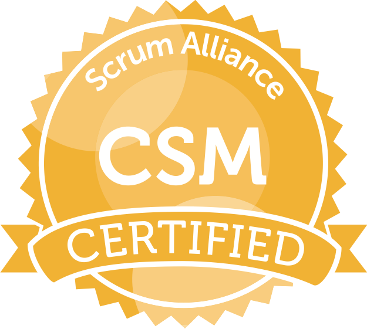
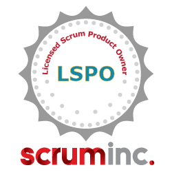

# スキル

## プログラミング言語
* Scala
  * Finagle
  * Finch
* Java
* Ruby
  * Ruby on Rails (職務経験は 5.0.x まで)

## アジャイル, マネジメント関連
* スクラム

  * 認定スクラムマスター (Scrum Alliance)
  * Licensed Scrum Product Owner (Scrum Inc. Japan)

# 職務経歴

## [シンプレクス株式会社](http://www.simplex.ne.jp) (2012年4月 ~ 2016年9月)

### 金利デリバティブリスク管理システムの国内都市銀行への導入プロジェクト (Simplex PRISM) (2012年7月 ~ 2013年7月)

#### 役割
* クライアントサイドアプリケーション開発 (Java SE7, Swing)
* データ移行ツール開発 (Java SE7)
* システム移行計画，作業の計画及び検証，リハーサルの推進
* システム移行チームメンバー

#### 技術要素
* Java SE7
  * Google Guice
  * Hibernate
  * Swing
  * 社内製アプリケーションフレームワーク
* Oracle 10g

### 金利/為替デリバティブリスク管理システムの国内メガバンクへの導入プロジェクト (Simplex PRISM) (2013年8月 ~ 2015年4月)
このプロジェクトは、Simplex PRISM を某国内メガバンクの公正価値評価システムの一部として導入するプロジェクトでした。

#### 役割
* 以下の金融商品の評価アルゴリズムの実装を担当した。
  * 金利スワップ
  * 金利スワップション
  * 金利先物および金利先物オプション
  * 債券先物および債券先物オプション
  * 為替オプション
* 評価アルゴリズム及びリスク評価アルゴリズムの自動化されたリグレッションテスト環境の構築
* OIS ベースのイールドカーブ評価ツール (Excel VBA を利用)

#### 技術要素
* Java SE 7
  * Google Guice
  * Hibernate
  * Hazelcast
  * Gridgain
  * Swing
  * 社内製アプリケーションフレームワーク
* Oracle 10g
* Microsoft Excel VBA

### 国内信託銀行向け対顧客為替取引管理システム (2015年4月~2016年8月)

#### 役割
* 社内向け為替注文管理システムの機能開発
* 新規配属された新卒社員2名のメンター担当
* 為替リスク管理システムの評価アルゴリズム検証

#### 技術要素
* Java SE 8
  * Spring Boot
* TypeScript
  * Backbone.js
* Oracle 10g

## [株式会社サイバーエージェント](https://www.cyberagent.co.jp/) [アドテクスタジオ](https://adtech.cyberagent.io/) (2016年10月 ~ 2018年1月)
### [AIRTRACK](https://www.airtrack.jp/) (位置情報データ管理プラットホーム)
オプトイン形式の位置情報データを集約し、行動動向をもとにユーザーをセグメント化するデータ管理プラットフォームの開発に従事しました。

#### 役割
* データ抽出バッチシステムの機能開発

#### 技術要素
* Java SE8
  * Spring
  * [Spark](sparkjava.com)
  * Doma 2.0
  * Eclipse Collections
* JavaScript
  * ECMAScript2015
  * Webpack
  * Babel
* Amazon Web Service
  * EC2
  * S3
  * Lambda
  * RDS (MySQL)
  * Redshift
  * ElastiCache (Redis 3.2)

### 新規 OpenRTB ベース広告入札システム (Demand Side Platform) 立ち上げ
新卒社員のアプリケーションエンジニア1名、他チーム兼任のインフラエンジニア1名と自分の3名で、新規 DSP プロダクトをスクラッチ開発しました。

#### My Role
* スクラムの導入 (ただしスクラムマスターのみ設置せず)。イベント及び成果物の運用、メンバーへの啓蒙など。
* プロダクトオーナーとしてのプロダクト開発に関する意思決定。
* リード開発者として、以下のシステムのアーキテクチャ設計、技術選定
  * OpenRTB 準拠の入札システム
  * インプレッション及びクリックの計測システム
  * 広告配信オペレーション用 Web UI

#### 技術要素
* Scala
  * [Finagle](http://twitter.github.io/finagle/)
  * [Finch](https://github.com/finagle/finch) (0.6.0)
  * [reladomo-scala](https://github.com/folio-sec/reladomo-scala)
* Flyway
* JavaScript
  * Vue.js
* Amazon Web Service
  * EC2
  * S3
  * RDS (MySQL)
  * Redshift
  * ElastiCache (Redis 3.2)
  * Athena
  * Kinesis Firehose

## [FOLIO](https://corp.folio-sec.com) 
* フィナンシャルテクノロジー部 (2018年2月 ~ 2019年8月)
* プロダクト事業部 (2019年9月~)

### 役割
* バックエンドシステムエンジニア
  * テーマ投資プロダクトの API サーバーの設計、開発および保守運用を行った。扱ったのは主に以下のシステム。
    * 商品管理システム
    * 参照データ配信システム
    * 顧客向け資産評価・参照データ
* アジャイルコーチとして、チームのスクラム実践の支援
* 組織再編に際した各種企画等。

### 技術要素
* Scala
  * Finagle / Finatra
* Domain Driven Design

### 登壇時スライド
* [Scala と Microservices でつくる証券会社とスタートアップ](https://speakerdeck.com/mura_mi/folio-in-jjug-ccc-2018-fall)
* [ありふれたもの，未だ見ぬもの ~ FOLIO プロダクト開発の現場から](https://speakerdeck.com/mura_mi/arihuretamofalse-wei-dajian-numofalse-folio-purodakutokai-fa-falsexian-chang-kara)

# 掲載記事
- [Forkwell Press (August 2018)](https://pr.forkwell.com/2018-08-17-090000/)
